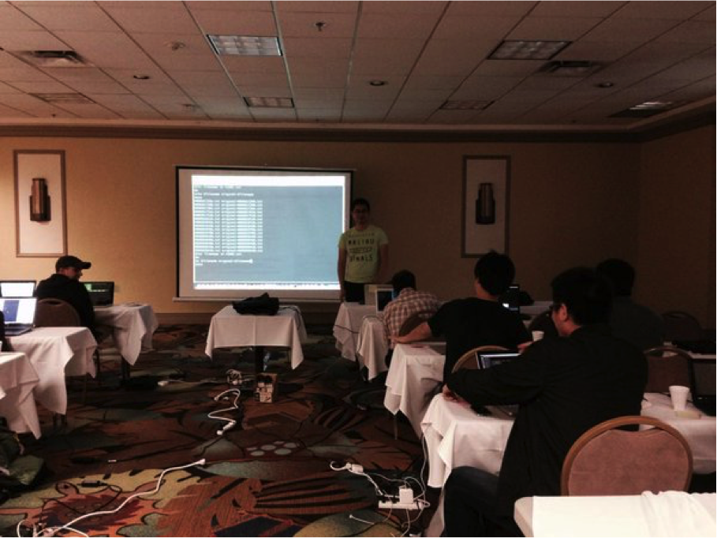
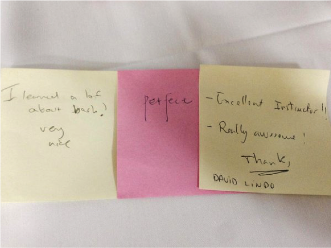

Software carpentry 2-day workshop

Description
======
I was excited to teach Shell and R to a group of 20 biologists from the University of Miami. This event was sponsored by Software carpentry https://software-carpentry.org/ and the University of Miami. see the course info [here](http://xuf12.github.io/2015-04-02-umiami/).

It was great teaching experience for me!

Teaching in action!
=====

Response
=====
Well received by the students!

