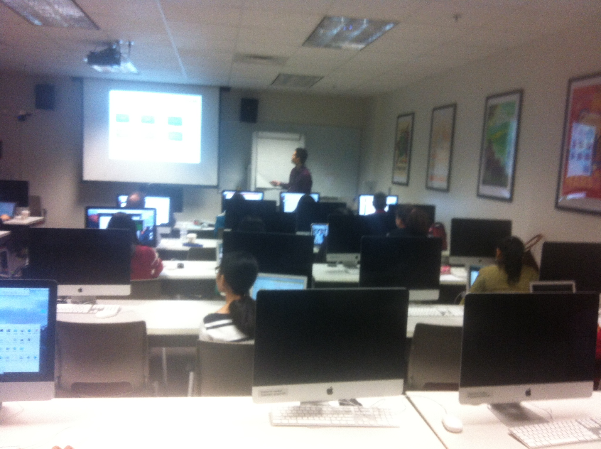

GS01 1143 Introduction to Bioinformatics

Description
======

I taught the ChIP-seq bioinformatics lab for the [GS01 1143 Introduction to Bioinformatics course](https://gsbs.uth.edu/academics/courses/course-detail.htm?id=55f674c2-80a6-4eaf-8ec1-39a20a8f719c) to ~30 people with diverse background. Some of them did not have any experience with terminals. I walked through the materials slowly and it was well received!

I developed the course materials [here](https://crazyhottommy.github.io/ChIP-seq-carpentry/).  
I plan to develope it to a [Data Carpentry](http://www.datacarpentry.org/) type of course materials, more work to come!

Enjoyed the teaching a lot!

Teaching in action!
=====

