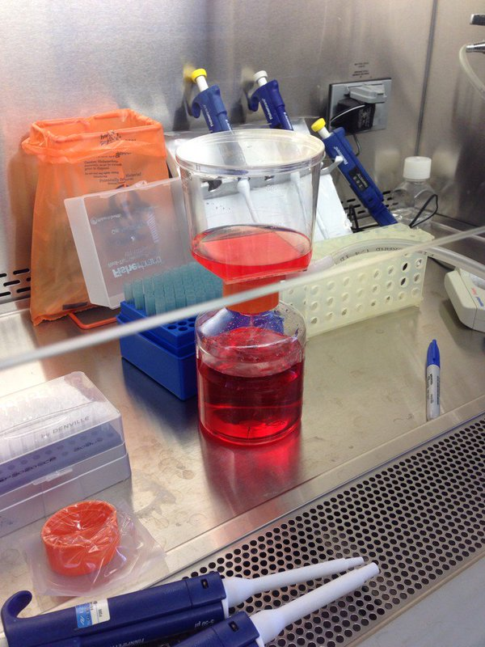
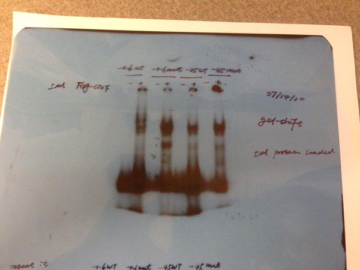
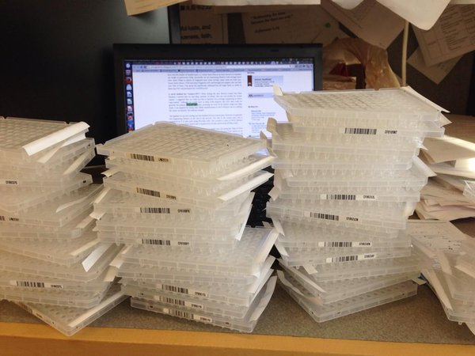
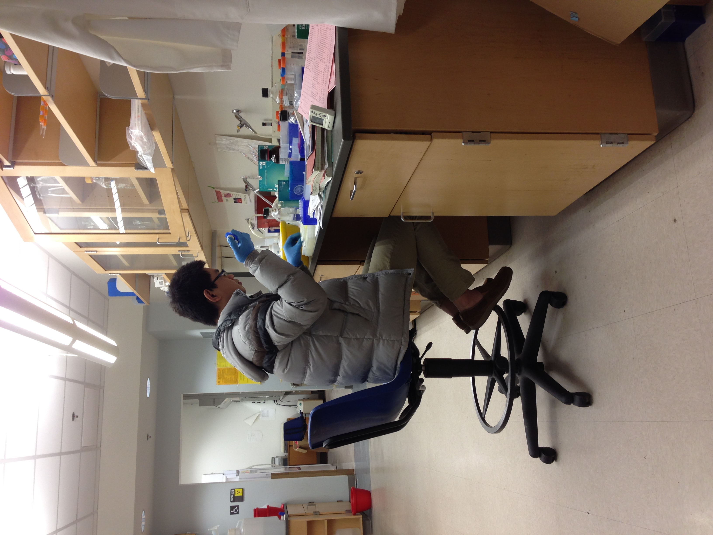

PhD in Genetics and Genomics

Description
======
I was trained in the Genetics and Genomics Program at University of Florida and graduated in 2014. I was mentored 
by [Dr.Jianrong Lu](http://biochem.med.ufl.edu/research/primary-faculty/jianrong-lu/) in the Biochemistry and Molecular Biology Department. My research was aimed at understanding epigenetic regulation of tumor metastasis.

I learned lots of bench skills such as cell culture, Northern blot, Western blot, PCR, RT-qPCR, gel electrophoresis, molecular cloning, DNA/RNA extraction, protein purification from bacteria, Co-Immunoprecipitation, GST pull-down assay, gel-shift assay, Chromatin immunoprecipitation (ChIP), Luciferase reporter assay, lenti-virus mediated shRNA knockdown etc.

It was great learning experience for me! The first four years of PhD training has laid down solid foundation for my understanding of cancer biology and molecular biology.

Tissue culture
=====

Gel-shift
=====
my second experience with p32 labeled experiment, the first was northern blot!

RT-qPCR 
====
hundreds of RT-qPCR plates.

Pipetting
====

