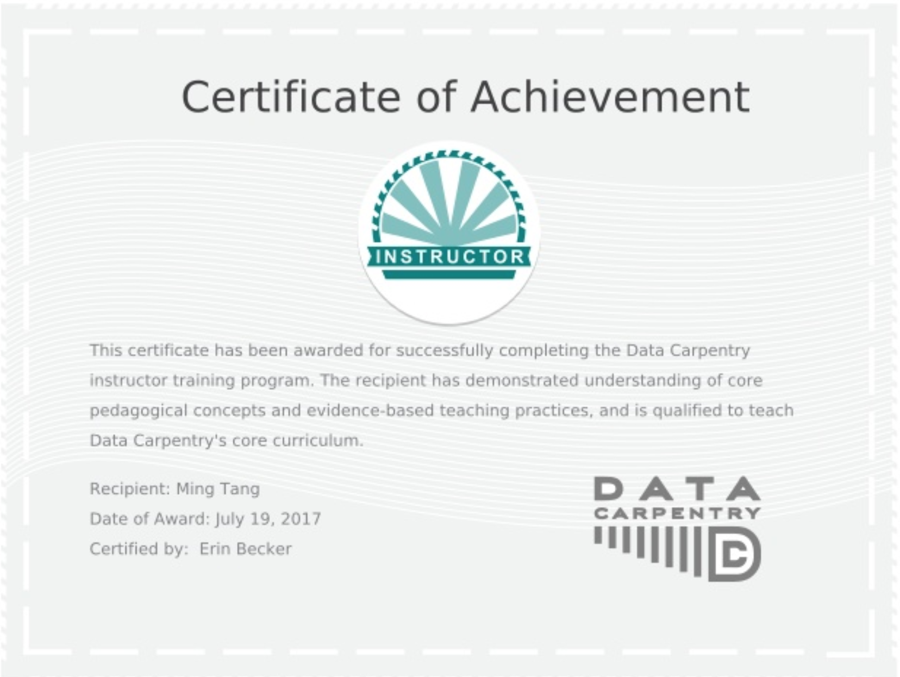

Instructor for Data Carpentry

Description
======
I went to the Data Carpentry and Software Carpentry instructor traning in [Data Intensive Biology Summer Research Institute](http://ivory.idyll.org/dibsi/), University of California, Davis.
The training was hosted by [Dr.Titus Brown](http://ivory.idyll.org/lab/).

I learned core pedagogical concepts, evidence-based teaching practices and how a Carpentry workshop is organized.

I am excited to be officially instructor and want to bring the workshops locally in Houston!

Certificate
=====

